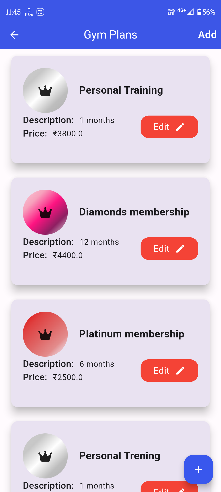

<!-- Project Title -->
<div align="center" style="display: flex; align-items: center; justify-content: center;">
  
</div>


<h1 align="center">FitStrong: Gym Management System</h1>
<p>The Gym Management System streamlines managing memberships, attendance, and member details. Admins can easily handle member info, plans, and records, ensuring efficient tracking of active and expired memberships with an intuitive interface for management and monitoring.
</p>


## 🔰 Project Overview
The Gym Management System is designed to simplify and streamline the management of gym memberships, member details, and attendance tracking. This comprehensive solution caters to gym administrators by providing a robust platform to manage all aspects of gym operations, from member registration to attendance monitoring.

---
### 🎥 Simple demo
<p align="center">
  
</p>

---
## ➤ Key Features

### Member Management:

- **Add Gym Members:** Easily add new members with detailed information.
- **Edit Member Details:** Modify member information and update membership plans.
- **Delete Members:** Remove members from the active list, with deleted members moved to a recycle bin for potential restoration.

### Membership Plans:

- **Create Membership Plans:** Define and manage various gym membership plans.
- **Renew Memberships:** Easily renew expired memberships to keep member access current.
- **Active and Expired Members Display:** View and manage lists of active members and those whose memberships have expired.

### Recycle Bin:

- **Deleted Members Storage:** Deleted members are stored in a recycle bin.
- **Restore Members:** Recover deleted members from the recycle bin when needed.

### Attendance Tracking:

- **QR Code Attendance System:** Members scan a QR code to access the attendance web app.
- **Automated Attendance Recording:** Members input their names, and the system automatically records the time.
- **Attendance Display:** Admins can view and monitor attendance records within the admin app.

### User-Friendly Interface:

- **Intuitive Design:** The app provides an easy-to-navigate interface for both admins and members.
- **Efficient Management:** Streamlined processes for adding, editing, and managing member details and attendance.

---
## 🛠 Technologies and Frameworks Used
-  **Flutter Framework** (Dart language)
- **User Interface Design:** Crafting an intuitive user interface designed for easy navigation and an enjoyable user experience.
-  

## ⚡Usage/Examples

```javascript
import 'package:flutter/material.dart';
void main() async {
  WidgetsFlutterBinding.ensureInitialized();
  await Firebase.initializeApp();
  runApp(MyApp());
}

//MyApp
class MyApp extends StatefulWidget {
  @override
  _MyAppState createState() => _MyAppState();
}

 Future<List<MemberModel>> getAllMembers() async {
    try {
      User? currentUser = FirebaseAuth.instance.currentUser;
      if (currentUser != null) {
        final querySnapshot = await FirebaseFirestore.instance
            .collection('Users')
            .doc(currentUser.uid)
            .collection('members')
            .get();
        _members =
            querySnapshot.docs.map((doc) => _memberFromSnapshot(doc)).toList();
        notifyListeners();
        return _members;
      } else {
        return [];
      }
    } catch (error) {
      print('Error fetching members: $error');
      return [];
    }
  }
```

## 🚀 Installation

1. **Clone the repository:**

   ```bash
   git clone https://github.com/sahilpotdukhe/FitStrongGym.git
2. **Navigate to the project directory:**
    ```bash
    cd arjunagym
3. **Install dependencies:**
    ```bash
    flutter pub get
4. **Run the app:**
    ```bash
    flutter run

## 📋 Requirements

- Flutter SDK: [Installation Guide](https://flutter.dev/docs/get-started/install)
- TMDB API: [Usage](https://developer.themoviedb.org/reference/intro/getting-started)

##  App Design

<div align="center">
  <table style="border-collapse: collapse;">
    <tr>
      <td style="padding-right: 0px; border: none;">
        
        <p align="center">Splash Screen</p>
      </td>
      <td style="padding-right: 0px; border: none;">
        
        <p align="center">Dashboard Screen</p>
      </td>
      <td style="border: none;">
        
        <p align="center">Add Members Screen </p>
      </td>
    </tr>
  </table>
</div>
<div align="center">
  <table style="border-collapse: collapse;">
    <tr>
      <td style="padding-right: 0px; border: none;">
        
        <p align="center">MembersList Screen</p>
      </td>
      <td style="padding-right: 0px; border: none;">
        
        <p align="center">GymPlans Screen</p>
      </td>
      <td style="border: none;">
        
        <p align="center">Attendance Screen </p>
      </td>
    </tr>
  </table>
</div>
<div align="center">
  <table style="border-collapse: collapse;">
    <tr>
      <td style="padding-right: 0px; border: none;">
        
        <p align="center">Menu Screen</p>
      </td>
      <td style="padding-right: 0px; border: none;">
        
        <p align="center">Profile Screen</p>
      </td>
      <td style="border: none;">
        
        <p align="center">RecycleBin Screen </p>
      </td>
    </tr>
  </table>
</div>

---
## 🤝 Contributing
Contributions are always welcome!
If you have a suggestion that would make this better, please fork the repo and create a pull request. Don't forget to give the project a star! Thanks again!
- Fork the Project
- Create your Feature Branch (```bash git checkout -b feature/AmazingFeature```)
- Commit your Changes (```bash git commit -m 'Add some AmazingFeature'```)
- Push to the Branch (```bash git push origin feature/AmazingFeature```)
- Open a Pull Request 


---
## ➤ Contact
You can reach out to me via the following methods:

- **Email:**  &nbsp;&nbsp;<a href="mailto:sahilpotdukhe.ssp@gmail.com">sahilpotdukhe.ssp@gmail.com
- **Social Media:**
   - &nbsp;&nbsp;[LinkedIn](https://www.linkedin.com/in/sahil-potdukhe/)
   - &nbsp;&nbsp;[GitHub](https://github.com/sahilpotdukhe)
   - &nbsp;&nbsp;[Instagram](https://www.instagram.com/sahilpotdukhe11/)
   - &nbsp;&nbsp;[Twitter](https://twitter.com/SahilPotdukhe)
  ---


